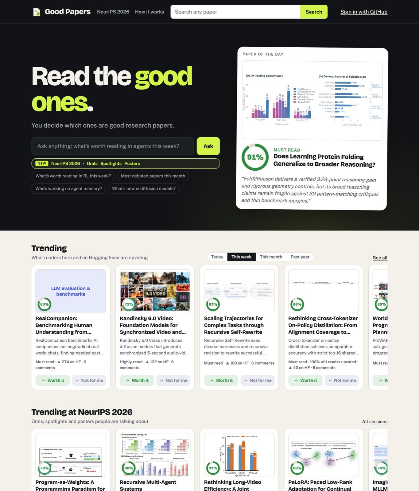
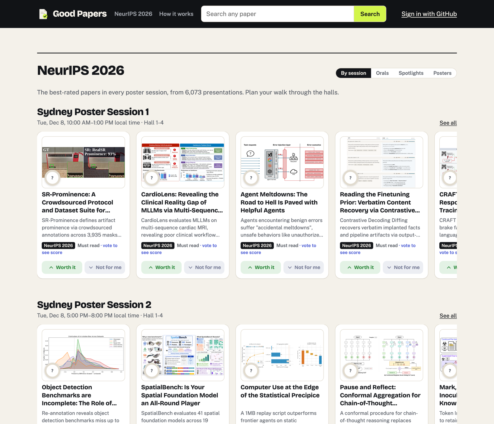
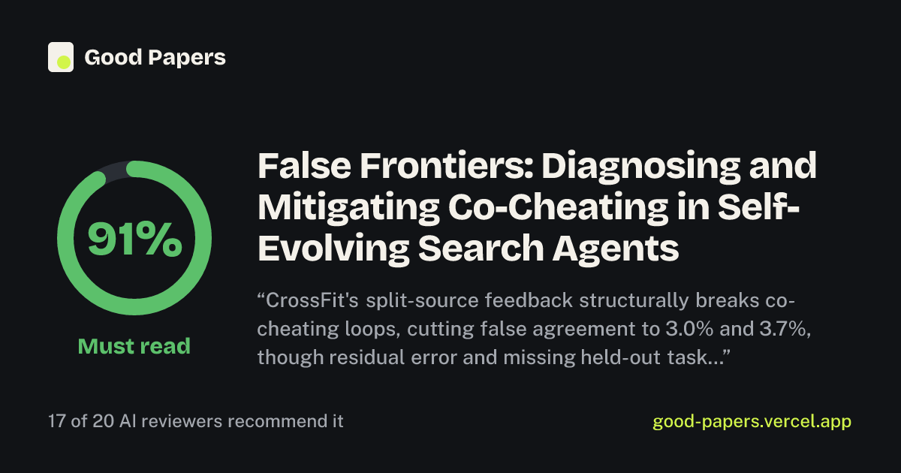
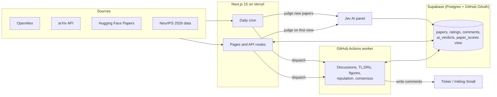

<div align="center">

# 📄✅ Good Papers

**Which ML papers are worth reading?**<br/>
Readers vote on the papers they've read, and a panel of 20 AI reviewers scores every paper from day one.<br/>
Think *Rotten Tomatoes*, but for research papers. 🍅➡️📄

[](https://www.goodpapers.org)
[](https://www.goodpapers.org/neurips)


<br/>

<a href="https://www.goodpapers.org">
  <picture>
    <source media="(prefers-color-scheme: dark)" srcset="docs/home-dark.png">
    
  </picture>
</a>

</div>

## ✨ Why Good Papers

- 🗳️ **Readers decide.** Signed-in readers upvote (*Worth reading*) or downvote (*Not for me*). Votes are weighted by reputation, conflicts of interest are left out, and agreement across different reader camps counts for more.
- 🤖 **AI from day one.** A panel of 20 reviewer personas (rigor, novelty, clarity, reproducibility, practical use, …) reads each paper so it has a score before anyone has voted, then steps back as readers arrive.
- 💬 **Discussion, not just a number.** AI reviewers open a debate under every paper and reply to readers; every AI comment is labeled.
- 🔥 **What's hot *and* what's good.** Trending follows Hugging Face's daily, weekly, monthly and past-year lists; *Must read* is this year's highest-rated work. Popularity never stands in for quality.
- 🎓 **NeurIPS 2026, session by session.** All 6,000+ accepted papers, with the best orals, spotlights and posters in every poster session.

## 📸 A look around

<table>
  <tr>
    <td width="55%" valign="top">
      <b>🎓 NeurIPS 2026, session by session</b><br/>
      <sub>The best-rated papers in every poster session, with local time and hall.</sub><br/><br/>
      <a href="https://www.goodpapers.org/neurips">
        <picture>
          <source media="(prefers-color-scheme: dark)" srcset="docs/neurips-dark.png">
          
        </picture>
      </a>
    </td>
    <td width="45%" valign="top">
      <b>🖼️ Every paper gets a share card</b><br/>
      <sub>Score, verdict and a line from the discussion, ready for X, Slack or WeChat.</sub><br/><br/>
      
    </td>
  </tr>
</table>

---

## 🧩 Features

| | |
| --- | --- |
| 🔎 **Search** | OpenAlex for the published record, plus the arXiv API (and optionally Semantic Scholar) for papers from the last week or two that OpenAlex hasn't indexed yet. |
| 🙋 **Ask** | Plain-English questions such as *"best RL posters at NeurIPS"* or *"who's working on agent memory?"*, parsed into intent, area and time window. Every answer comes from the site's own ratings, so every paper it names is real. |
| 📚 **Shelves** | Trending (today / this week / this month / past year), Trending at NeurIPS 2026, Must read, Most debated, Paper of the day. |
| 📄 **Paper pages** | Score card, AI panel breakdown, TL;DR, panel consensus line, first figure, Hugging Face upvotes and code links, threaded discussion. |
| 🎓 **NeurIPS 2026** | Every accepted paper with its track and poster session; the best papers per session in local time and room. |
| 🖼️ **Sharing** | Generated share cards (Open Graph images) and a share menu on every paper. |
| 🔔 **Notifications** | A bell for replies to your comments, from readers or the AI panel. |
| 🌍 **SEO** | Sitemap of all rated papers, canonical URLs and `ScholarlyArticle` structured data. |

## 🏗️ Architecture



- **Web app** — Next.js 15 (App Router, TypeScript), server-rendered and deployed on Vercel.
- **Database** — Supabase Postgres with row-level security. Scores are computed in SQL by the `paper_scores` view; the AI panel's curve is precomputed in the `ai_curve` materialized view.
- **AI panel** — Jev (TypeSafe AI) answers 20 typed questions per paper (one per persona) plus the research area (~190 areas in 20 groups) and paper type.
- **Discussion worker** — Python on GitHub Actions. Writes AI comments, TL;DRs and consensus lines with Tinker's `Inkling-Small`, labels comment stances with Jev, fetches figures and Hugging Face data, and computes reader reputation. It runs daily and whenever the site dispatches it (new papers, reader comments).
- **Daily cron** — Rates every paper on Hugging Face's lists the site doesn't have yet, refreshes citations and wakes the worker.

## 🚀 Getting started

Requirements: Node.js 20+, Python 3.11+ (for the worker), a Supabase project, and a Jev API key.

```bash
git clone https://github.com/LzyFischer/good-papers.git
cd good-papers
npm install
cp .env.example .env.local   # then fill in the values
```

Set up the database: in the Supabase SQL editor, run `supabase/schema.sql` on a fresh project (or the files in `supabase/migrations/` in order on an existing one). Enable the GitHub provider under *Authentication → Providers*.

```bash
npm run dev          # http://localhost:3000
npm run build        # must pass before every commit
```

Worker (optional, for AI discussions):

```bash
python3 -m venv worker/.venv
worker/.venv/bin/pip install -r worker/requirements.txt
worker/.venv/bin/python worker/rp_worker.py --dry-run
```

## ⚙️ Configuration

All variables go in `.env.local` locally and in the Vercel project settings in production; the worker reads its own from GitHub Actions secrets. See [`.env.example`](.env.example).

| Variable | Required | Purpose |
| --- | --- | --- |
| `NEXT_PUBLIC_SUPABASE_URL`, `NEXT_PUBLIC_SUPABASE_ANON_KEY` | yes | Supabase project |
| `SUPABASE_SERVICE_ROLE_KEY` | yes | Server-side writes. Never expose to the browser. |
| `TYPESAFE_API_KEY`, `JEV_MODEL` | yes | AI panel |
| `CRON_SECRET` | yes | Protects `/api/cron` and `/api/judge` |
| `SITE_URL` | production | Public address for canonical links and the sitemap |
| `OPENALEX_MAILTO`, `OPENALEX_API_KEY` | recommended | OpenAlex polite pool and budget |
| `GH_WORKFLOW_TOKEN` | optional | Lets the site dispatch the worker (fine-grained token, Actions: write) |
| `S2_API_KEY` | optional | Semantic Scholar search and venues |
| `FULL_TEXT` | optional | `1` lets the panel read introductions and conclusions (~5× the tokens) |
| `GOOGLE_SITE_VERIFICATION` | optional | Search Console verification tag |

Worker secrets: `NEXT_PUBLIC_SUPABASE_URL`, `SUPABASE_SERVICE_ROLE_KEY`, `TYPESAFE_API_KEY`, `TINKER_API_KEY`, `OPENALEX_API_KEY`.

## 🛠️ Scripts

| Command | What it does |
| --- | --- |
| `npm run dev` / `npm run build` | Develop / production build |
| `npm run judge -- scripts/my-papers.json` | Judge the papers listed in a file and store them |
| `npm run rejudge` | Re-judge every stored paper (after editing personas or areas) |
| `npm run backfill:hf` | Rate every paper on Hugging Face's lists that isn't stored yet |
| `npm run import:neurips` | Import NeurIPS 2026 accepted papers and judge them (resumable) |

## 🗂️ Project layout

```
app/                 Pages (home, paper, NeurIPS, Ask, search, How it works) and API routes
components/          Cards, score gauges, vote buttons, comments, share menu
lib/                 Scoring, AI panel (judge, personas, areas), data sources, shelves
worker/              Discussion worker: comments, TL;DRs, figures, reputation, consensus
scripts/             Judging, backfills and the NeurIPS import
supabase/            schema.sql and numbered migrations
.github/workflows/   The worker's schedule
```

## 🤝 Data sources and etiquette

- **OpenAlex** (search, citations, institutions), **arXiv API** (new papers, abstracts, figures from arXiv HTML), **Hugging Face Papers** (trending lists, upvotes), **Semantic Scholar** (optional), **neurips.cc** conference data and **OpenReview** (NeurIPS abstracts, through the owner's account).
- The site uses official APIs, respects each source's rate limits and `robots.txt`, and never bypasses bot challenges.
- AI involvement is always visible: paper cards and pages show the AI panel's verdict, the How it works page explains it, AI comments carry an **AI** badge, and AI reviewers may be blunt about the work but never about people.

## 🗺️ Roadmap

- [x] Reader votes, reputation and conflict-of-interest rules
- [x] 20-persona AI panel and AI discussions
- [x] Trending from Hugging Face, NeurIPS 2026 by session
- [ ] 🕵️ A fact-check gate for AI comments before they are posted
- [ ] 🧩 Browser extension: a paper's score on arXiv, OpenReview and Google Scholar pages
- [ ] 🔌 Public API and an MCP server for agents
- [ ] 🕸️ Citation graph and researcher-adjusted impact

---

<div align="center">

Made with 💚 and too many PDFs by [Zhenyu Lei](https://github.com/LzyFischer)<br/>
Found a bug or a wrong score? [Open an issue](https://github.com/LzyFischer/good-papers/issues) 🐛

</div>
